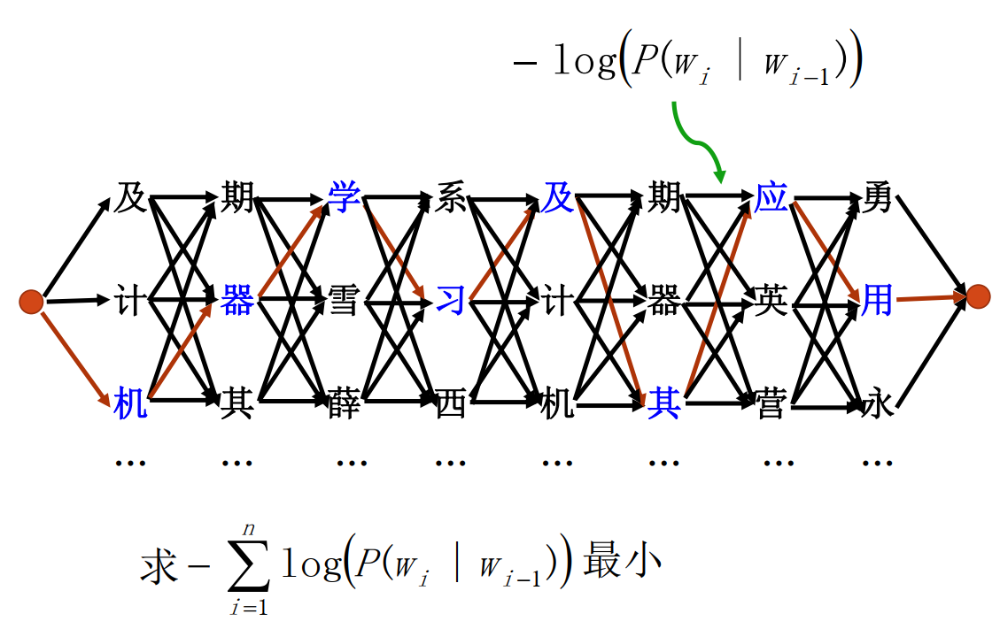

# 实验报告——拼音输入法

### 张天乐 计96 2018011038

#### 1.基本思路

对于拼音$O$，对应汉字语句$S = w_1w_2…w_k$的概率$P(S|O)=P(S)P(O|S)/P(O)$。其中$P(O)$为常量，$P(O|S)$用识别信度代替$P(O|S) \approx 1$，$P(S)=\prod^n_{i=1}P(w_i|w_1...w_{i-1})$。求$P(S|O)$最大，即求$P(S)=\prod^n_{i=1}P(w_i|w_1...w_{i-1})$最大。

使用二元语法简化问题，$P(S)=\prod^n_{i=1}P(w_i|w_{i-1})$。求$\max(\prod^n_{i=1}P(w_i|w_{i-1}))$所对应的句子，等价于求$\min(-\sum^n_{i=1}\log(P(w_i|w_{i-1})))$所对应的句子。

最终，该问题转变为如下求最短路径问题



基于字的二元模型，P(w_i|w_{i-1})$计算方法如下：
$$
P(w_i|w_{i-1})=\frac{w_iw_{i-1}同现的次数}{w_{i-1}出现的次数}
$$
对于$P(w_i|w_{i-1})$可能为0的问题，可以平滑处理：
$$
\lambda P(w_i|w_{i-1})+(1-\lambda)P(w_i) \Rightarrow P(w_i|w_{i-1})
$$


#### 2.实验环境  

本项目使用python3编写，使用第三方库`chardet`来应对文件编码问题。你可以执行以下指令来安装：

```
$ pip install chardet
```


#### 3.数据预处理方法及实验思路

对于汉字表，和拼音汉字表，可以构造一个字表`chars = [w_0, w_1, ...]`和一个音字对照表`pinyin2chars = {p_0:[w_00, w_01, ...], p_1:[w_10, w_11, ...], ...}`。

对于语料库，构造`mode = [{'times':1, 'next':{}} for i in range(len(chars))]`。对每个字$w_{i-1}$统计出现的次数，以及所有二元组$w_{i-1}w_i$和出现次数。

将它们保持下来，可以直接作为训练好的模型使用。

翻译句子时，使用viterbi算法，每层即为一个拼音，每层的点是该拼音可能的汉字。起始权值为0，边长为$-\log(\lambda P(w_i|w_{i-1})+(1-\lambda)P(w_i)) = -\log(\lambda\frac{w_iw_{i-1}同现的次数}{w_{i-1}出现的次数} + (1-\lambda)\frac{w_i出现次数}{该层所有w_i出现次数总和})$

求最短路径即可。

####  

#### 4.实验效果

使用新浪新闻的语料库，以及给定的测试样例，在所用参数$\lambda=0.99999$时，子准确率和句准确率如下：

| 字准确率 | 85.24% |
| -------- | ------ |
| 句准确率 | 38.8%  |

通过观察效果好和差的例子不难发现，测试样例中新闻语句正确率更高，相反口语化生活化的语句正确率反而较低，以下是部分效果好和差的例子：

##### 效果好的例子

* 经济建设和文化建设突出了十八大精神的重要性
* 以习近平同志为总书记的党中央
* 走中国特色社会主义道路
* 清华大学是世界一流大学
* 对亚洲人的种族歧视已经在全球蔓延
* 有个主播今天开挂了
* 北京冬奥会开幕式举行后

##### 效果差的例子

* 年年不忘必有回乡 （念念不忘必有回响）
* 他说不新要不传谣 （他说不信谣不传谣）
* 凶手的纸上忽然成了附属 （凶手的智商忽然成了负数）
* 本地的帮会太美丽冒了 （本地的帮会太没礼貌了）
* 我的却很喜欢吃煎饼果子 （我的确很喜欢吃煎饼果子）
* 北京市首个举办过夏奥会与冬奥会的城市 （北京是首个举办过夏奥会与冬奥会的城市）
* 该账号开通仅仅四十八小时细分二十九晚 （该账号开通仅仅四十八小时吸粉二十九万）

可以看到因为模式是基于字的二元模型，有些同音词（附属，负数）没法很好区分。以及形如abc的字，不能区分到底是ab组成词，还是bc组成词（美丽冒，没礼貌）。不过对于常用字词还是能很好的判断出来。


#### 5.参数对性能的影响  

实验中，对于$P(w_i|w_{i-1})$可能为0的问题，使用了如下平滑处理：
$$
\lambda P(w_i|w_{i-1})+(1-\lambda)P(w_i) \Rightarrow P(w_i|w_{i-1})
$$
不同的$\lambda$会对性能产生影响，因此测试了不同$\lambda$下的字句准确率。

| $\lambda$ | 字准确率 | 句准确率 |
| --------- | -------- | -------- |
| 0.9       | 68.64%   | 6.4%     |
| 0.99      | 80.11%   | 25.4%    |
| 0.999     | 84.37%   | 36.0%    |
| 0.9999    | 85.15    | 38.4%    |
| 0.99999   | 85.24%   | 38.8%    |
| 0.999999  | 85.22%   | 38.6%    |
| 0.9999999 | 85.20%   | 38.4%    |

因此本模型使用$\lambda=0.99999$
